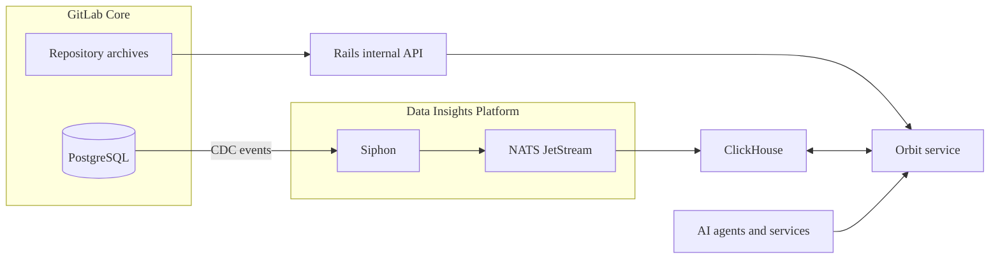



- Tier: Ultimate
- Offering: GitLab.com
- Status: Experiment





- [Introduced](https://gitlab.com/gitlab-org/gitlab/-/work_items/583676) in GitLab 18.10 [with a feature flag](https://docs.gitlab.com/administration/feature_flags/) named `knowledge_graph`. Disabled by default.



> [!flag]
> The availability of this feature is controlled by a feature flag.
> For more information, see the history.
> This feature is available for testing, but not ready for production use.

Orbit is a data analysis and observability engine for GitLab.
It indexes your groups, projects, and repositories, then analyzes
the relationships between them to build a knowledge graph of your
instance. The knowledge graph is a structured, queryable map of your
entire software development lifecycle. Use it to understand how your
work is organized and how its parts relate to each other.

Orbit exposes the knowledge graph through a unified context API.
Explore the graph in the GitLab UI or query it with an AI tool like
GitLab Duo to bring full workspace context into your agentic AI
sessions.

You can use Orbit to get answers to questions like:

- Based on past reviews and file ownership, who should review this change?
- Have any vulnerabilities been found in this project, and are any unresolved?
- Which projects depend on this module or library?
- What work items are assigned to this user in these projects?

## Data sources

Orbit indexes two categories of data:

1. GitLab data includes the software development lifecycle objects that make up your instance:

   - Groups and projects
   - Users
   - Work items
   - Merge requests
   - Pipelines
   - Vulnerabilities and security findings

1. Code includes the content of your repositories:

   - Source files and directories
   - Function, class, and module definitions
   - Imports and cross-file references

PostgreSQL emits change data capture (CDC) events to Siphon, which forwards them through NATS JetStream into ClickHouse.
In parallel, Orbit downloads code from repository archives through the Rails internal API. Orbit combines GitLab data and code,
then writes the unified property graph to ClickHouse. Users and AI agents can query the graph through the unified context API.

## Performance

The Orbit indexer runs in a separate Kubernetes cluster and does not
impact the performance of your instance.  The indexer job completes in
seconds, even for large groups.

Changes to a group, project, or repository are reindexed automatically.
Reindexing typically completes a few minutes after a change.

## Coverage

Orbit indexes only the top-level groups where it is turned on.
Subgroups and projects inherit indexing from the top-level group.

Code is indexed from only the default branch.

### Supported languages

Orbit supports code indexing for the following languages:

| Language   | Definitions & imports | References within files | References across files |
|------------|-----------------------|-------------------------|-------------------------|
| Ruby       |            |              |              |
| Java       |            |              |              |
| Kotlin     |            |              |              |
| Python     |            |              |               |
| TypeScript |            |              |               |
| JavaScript |            |              |               |

## Feedback

Your feedback is valuable in helping us improve this feature.
Share your experience in [issue 592436](https://gitlab.com/gitlab-org/gitlab/-/work_items/592436).
