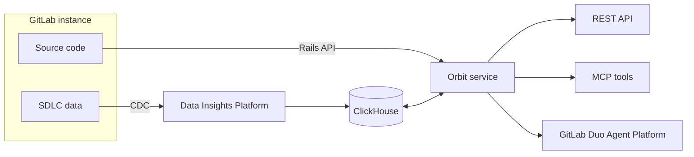
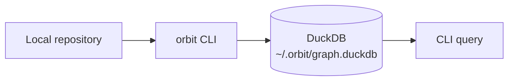



- Tier: Premium, Ultimate
- Offering: GitLab.com
- Status: Experiment





- [Introduced](https://gitlab.com/gitlab-org/gitlab/-/work_items/583676) in GitLab 18.10 [with a feature flag](https://docs.gitlab.com/administration/feature_flags/) named `knowledge_graph`. Disabled by default. This feature is an [experiment](https://docs.gitlab.com/policy/development_stages_support/#experiment).



> [!flag]
> The availability of this feature is controlled by a feature flag.
> For more information, see the history.
> This feature is available for testing, but not ready for production use.

<!-- -->

> [!disclaimer]

Orbit indexes your GitLab instance and exposes your entire SDLC as a queryable knowledge graph.
Enable it on a group and Orbit maps everything: projects, users, merge requests, pipelines,
work items, security findings, and the source code itself, then builds a property graph of how they
relate to each other.

Query the graph to answer questions your instance cannot answer directly:

- What breaks if I change this service?
- Which merge requests touched this file in the last 90 days?
- Who has reviewed the most code in this group?
- Where are the open critical vulnerabilities, and which pipelines introduced them?
- Which projects depend on this library?

*Orbit is an analytical system designed for point-in-time SDLC insight, not real-time or transactional use cases. Results reflect the state of your data as of the last index cycle.*

## Orbit Remote

On GitLab.com, Orbit Remote runs as a separate service on GitLab infrastructure. Enable it on a top-level group
and it automatically indexes your entire SDLC and code - groups, projects, users, merge requests,
pipelines, vulnerabilities, and source code - into a managed ClickHouse graph.

Orbit Remote runs as a separate service and shares minimal load with your GitLab instance.

[Get started with Orbit Remote](remote/getting-started.md)

## Orbit Local

Orbit Local runs entirely on your machine. The `orbit` CLI parses a local repository,
extracts definitions and cross-file references, and writes the graph to a local DuckDB file.
No GitLab instance or network connection required.

Orbit Local indexes code only. SDLC data - merge requests, pipelines, work items - requires
Orbit Remote.

[Get started with Orbit Local](local/getting-started.md)

## What Orbit indexes

Orbit indexes two categories of data:

- SDLC objects from your GitLab instance: groups, projects, users, merge requests, pipelines, jobs,
  work items, milestones, labels, and security findings.

- Source code from your repositories: files, directories, function and class definitions, and
  cross-file import references. Code is indexed from the default branch only.

Orbit indexes code in Ruby, Java, Kotlin, Python, TypeScript, JavaScript, Rust, Go, C#, C, and C++.

[Full indexing coverage](remote/indexing.md) | [Schema reference](remote/schema.md)

## Get started

- [Enable Orbit Remote and run your first query](remote/getting-started.md)
- [Build a local code graph with Orbit Local](local/getting-started.md)
