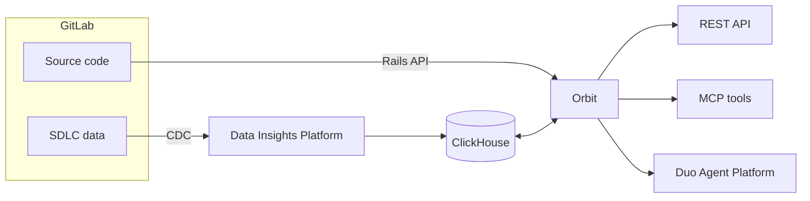



- Tier: Premium, Ultimate
- Offering: GitLab.com
- Status: Experiment





- [Introduced](https://gitlab.com/gitlab-org/gitlab/-/work_items/583676) in GitLab 18.10 [with a feature flag](https://docs.gitlab.com/administration/feature_flags/) named `knowledge_graph`. Disabled by default.



> [!flag]
> The availability of this feature is controlled by a feature flag.
> For more information, see the history.
> This feature is available for testing, but not ready for production use.

Orbit indexes your GitLab instance and exposes your entire SDLC as a queryable knowledge graph.
Enable it on a group and Orbit maps everything: projects, users, merge requests, pipelines,
work items, security findings, and the source code itself, then builds a graph of how they
relate to each other.

Query the graph to answer questions your instance cannot answer directly:

- What breaks if I change this service?
- Which merge requests touched this file in the last 90 days?
- Who has reviewed the most code in this group?
- Where are the open critical vulnerabilities, and which pipelines introduced them?
- Which projects depend on this library?

## Indexer options

Orbit comes in two forms:

| | Remote indexer | Local indexer |
|---|---|---|
| **Who it's for** | GitLab.com Premium and Ultimate | Community Edition and self-managed |
| **Runs on** | GitLab-hosted infrastructure | Your own machine |
| **Storage** | ClickHouse (managed) | DuckDB (local file) |
| **Status** | Experiment | Developer preview |

[Get started: remote indexer](get_started.md#remote-indexer) |
[Get started: local indexer](get_started.md#local-indexer)

## How it works

Orbit runs as a separate service. It does not share resources with your GitLab instance
and does not affect its performance.

[How Orbit works in detail](how_orbit_works.md)

## What Orbit indexes

Orbit indexes two categories of data:

**SDLC objects** from your GitLab instance:
groups, projects, users, merge requests, pipelines, jobs, work items, milestones, labels,
and security findings.

**Source code** from your repositories:
files, directories, function and class definitions, and cross-file import references.
Code is indexed from the default branch only.

**Supported languages for code indexing:**
Ruby, Java, Kotlin, Python, TypeScript, JavaScript, Rust, Go, C#, C, C++

[Full indexing coverage](indexing.md) | [Schema reference](schema.md)

## Get started

[Enable Orbit and run your first query](get_started.md)
