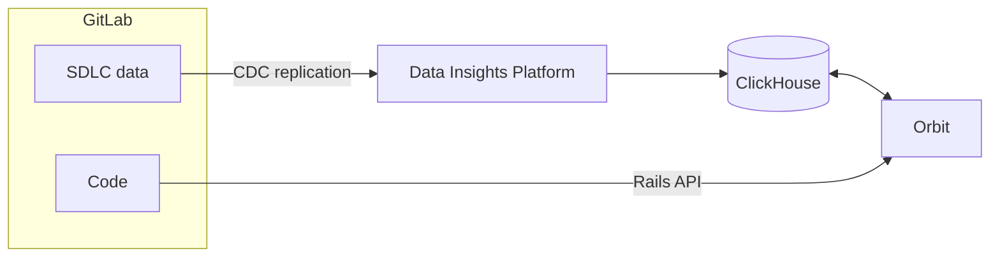



- Tier: Premium, Ultimate
- Offering: GitLab.com
- Status: Experiment





- [Introduced](https://gitlab.com/gitlab-org/gitlab/-/work_items/583676) in GitLab 18.10 [with a feature flag](https://docs.gitlab.com/administration/feature_flags/) named `knowledge_graph`. Disabled by default.



> [!flag]
> The availability of this feature is controlled by a feature flag.
> For more information, see the history.
> This feature is available for testing, but not ready for production use.

Orbit is an AI-queryable knowledge graph of your software development
lifecycle. It indexes your groups, projects, and repositories, then
analyzes the relationships between them to build a structured map of
your entire GitLab instance.

Orbit exposes the knowledge graph through a unified context API.
Explore the graph in the GitLab UI or query it with GitLab Duo or
other MCP-enabled AI tools to bring full workspace context into your
agentic AI sessions.

You can use Orbit to get answers to questions like:

- Based on past reviews and file ownership, who should review this change?
- Which MRs introduced vulnerabilities in these projects?
- Which projects depend on this module or library?
- What work items are assigned to this user in these projects?
- Which projects do most pipeline failures come from?

<!--- To get started with Orbit ... --->

## Performance

The Orbit indexer runs in a separate Kubernetes cluster and does not
impact the performance of your instance. The indexer job completes in
seconds, even for large groups.

Changes to a group, project, or repository are reindexed automatically.
Reindexing typically completes a few minutes after a change.

<!--- ## Billing and usage --->

## Coverage

Orbit indexes only the top-level groups where it is turned on.
Subgroups and projects inherit indexing from the top-level group.

Orbit indexes two types of data:

1. GitLab data includes the software development lifecycle objects that make up your instance:

   - Groups and projects
   - Users
   - Work items
   - Merge requests
   - Pipelines
   - Vulnerabilities and security findings

1. Code includes the content of your repositories:

   - Source files and directories
   - Function, class, and module definitions
   - Imports and cross-file references

   Code is indexed from only the default branch.

The following diagram shows how Orbit builds the knowledge graph:

GitLab data is streamed through change data capture (CDC) events to
the GitLab Data Insights Platform, which writes to ClickHouse. Code
is served to Orbit over the Rails internal API. To build the graph,
Orbit combines SDLC data and code into a graph table, then writes the
result to ClickHouse.

### Supported languages

Orbit supports code indexing for the following languages:

- Ruby
- Java
- Kotlin
- Python
- TypeScript
- JavaScript
- Rust
- C#
- Go

## Feedback

Your feedback is valuable in helping us improve this feature.
Share your experience in [issue 592436](https://gitlab.com/gitlab-org/gitlab/-/work_items/592436).
