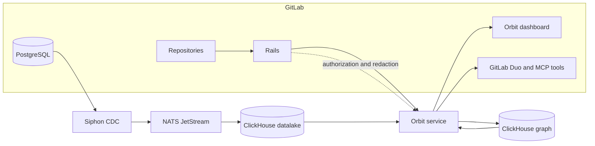



- Tier: Premium, Ultimate
- Offering: GitLab.com
- Status: Experiment





- [Introduced](https://gitlab.com/gitlab-org/gitlab/-/work_items/583676) in GitLab 18.10 [with a feature flag](https://docs.gitlab.com/administration/feature_flags/) named `knowledge_graph`. Disabled by default.



> [!flag]
> The availability of this feature is controlled by a feature flag.
> For more information, see the history.
> This feature is available for testing, but not ready for production use.

Orbit is the GitLab knowledge graph. It indexes GitLab software development
lifecycle data and repository code, then stores the result as connected objects
that humans, GitLab Duo, and external AI tools can query.

Most GitLab APIs answer one narrow question at a time. Orbit answers questions that
depend on relationships:

- Which merge requests changed files connected to a failing pipeline?
- Who has reviewed similar code before?
- Which open vulnerabilities are linked to recently merged work?
- What projects, work items, pipelines, and code definitions are connected to this
  group?

GitLab Duo can use Orbit as a context source, but Orbit also provides its own
dashboard, API, schema browser, query language, and MCP tools.

## Ways to use Orbit

Orbit has two execution modes:

| Mode | Best for | Data source | Storage | Availability |
|------|----------|-------------|---------|--------------|
| Deployed Orbit service | Querying GitLab.com group data through the dashboard, API, GitLab Duo, or MCP tools. | GitLab SDLC data replicated through Siphon, plus repository code from GitLab. | ClickHouse graph tables managed by Orbit. | GitLab.com experiment. |
| Local Orbit indexer | Trying the local code graph against a checkout on your machine. | Files in a local Git repository. | DuckDB database under `~/.orbit/`. | Developer preview, built from source. |

The deployed service is the production architecture. It runs outside Rails, uses
ClickHouse for graph queries, and delegates authorization back to GitLab. The local
indexer is a developer preview for source-built workflows. It uses the same JSON
query language where possible, but it does not include the hosted dashboard,
GitLab.com authorization, or the full SDLC graph.

## What Orbit indexes

Orbit indexes only top-level groups where Orbit is turned on. Subgroups and
projects inherit indexing from the top-level group.

Orbit indexes GitLab data such as:

- Groups and projects.
- Users.
- Work items.
- Merge requests and merge request diffs.
- Pipelines, stages, jobs, runners, deployments, and environments.
- Vulnerabilities, findings, scanners, identifiers, and security scans.

Orbit also indexes code from the default branch, including:

- Branches, directories, and source files.
- Function, class, method, and module definitions.
- Imports and cross-file references.

Code indexing supports these languages:

- Ruby
- Java
- Kotlin
- Python
- TypeScript
- JavaScript
- Rust
- C#
- Go

## How Orbit fits together

The deployed service reads from GitLab through two paths: replicated SDLC data
and repository code APIs. It writes its own graph tables to ClickHouse and serves
queries back to GitLab clients.

For more information, see [How Orbit works](how_orbit_works.md).

## Start using Orbit

- To turn on Orbit and explore the dashboard, see [Get started with Orbit](configure.md).
- To run structured queries, see [Queries](queries/_index.md).
- To inspect available node types and relationships, see [Knowledge graph schema](schema.md).
- To try the source-built local indexer, see [Local Orbit indexer developer preview](local_indexer.md).
- To troubleshoot indexing and MCP connections, see [Troubleshooting Orbit](orbit_troubleshooting.md).

## Feedback

Your feedback helps shape this experiment. Share your experience in
[issue 592436](https://gitlab.com/gitlab-org/gitlab/-/work_items/592436).
