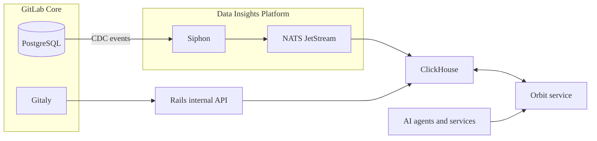

Orbit ingests two categories of data:

1. GitLab data includes the software development lifecycle objects that make up your instance:

   - Groups and projects
   - Users
   - Work items
   - Merge requests
   - Pipelines
   - Vulnerabilities and security findings

1. Code includes the content of the default branch in each project:

   - Source files and directories
   - Function, class, and module definitions
   - Imports and cross-file references

Orbit indexes code from only the default branch of each project in enabled groups.

GitLab streams GitLab data and code-indexing tasks from PostgreSQL as change data capture (CDC) events through the
[Data Insights Platform](https://handbook.gitlab.com/handbook/engineering/architecture/design-documents/data_insights_platform/).

Code is indexed from repository archives that Orbit downloads through the GitLab Rails internal API.
Orbit parses these archives and writes the data to ClickHouse as part of the knowledge graph.

## Supported languages

Code indexing is supported for the following languages:

| Language  | Definitions & imports | References within files   | References across files    |
|-----------|-----------------------|---------------------------|----------------------------|
| Ruby      | {{ yes }}             | {{ yes }}                 | {{ yes }}                  |
| Java      | {{ yes }}             | {{ yes }}                 | {{ yes }}                  |
| Kotlin    | {{ yes }}             | {{ yes }}                 | {{ yes }}                  |
| Python    | {{ yes }}             | {{ yes }}                 | {{ no }}                   |
| TypeScript| {{ yes }}             | {{ yes }}                 | {{ no }}                   |
| JavaScript| {{ yes }}             | {{ yes }}                 | {{ no }}                   |