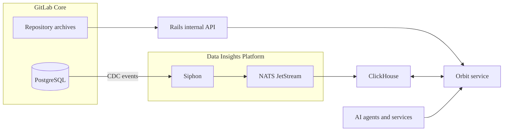

Orbit indexes only the top-level groups where it is enabled.
Subgroups and projects inherit indexing from the top-level group.

Orbit indexes two categories of data:

1. GitLab data includes the software development lifecycle objects that make up your instance:

   - Groups and projects
   - Users
   - Work items
   - Merge requests
   - Pipelines
   - Vulnerabilities and security findings

1. Code includes the content of your repositories:

   - Source files and directories
   - Function, class, and module definitions
   - Imports and cross-file references

   Orbit indexes code from only the default branch.

PostgreSQL emits change data capture (CDC) events to Siphon, which forwards them through NATS JetStream into ClickHouse.
In parallel, Orbit downloads code from repository archives through the Rails internal API. Orbit combines GitLab data and code,
then writes the unified property graph to ClickHouse. Users and AI agents can query the graph through the unified context API.

## Supported languages

Orbit supports code indexing for the following languages:

| Language   | Definitions & imports | References within files | References across files |
|------------|-----------------------|-------------------------|-------------------------|
| Ruby       |            |              |              |
| Java       |            |              |              |
| Kotlin     |            |              |              |
| Python     |            |              |               |
| TypeScript |            |              |               |
| JavaScript |            |              |               |
