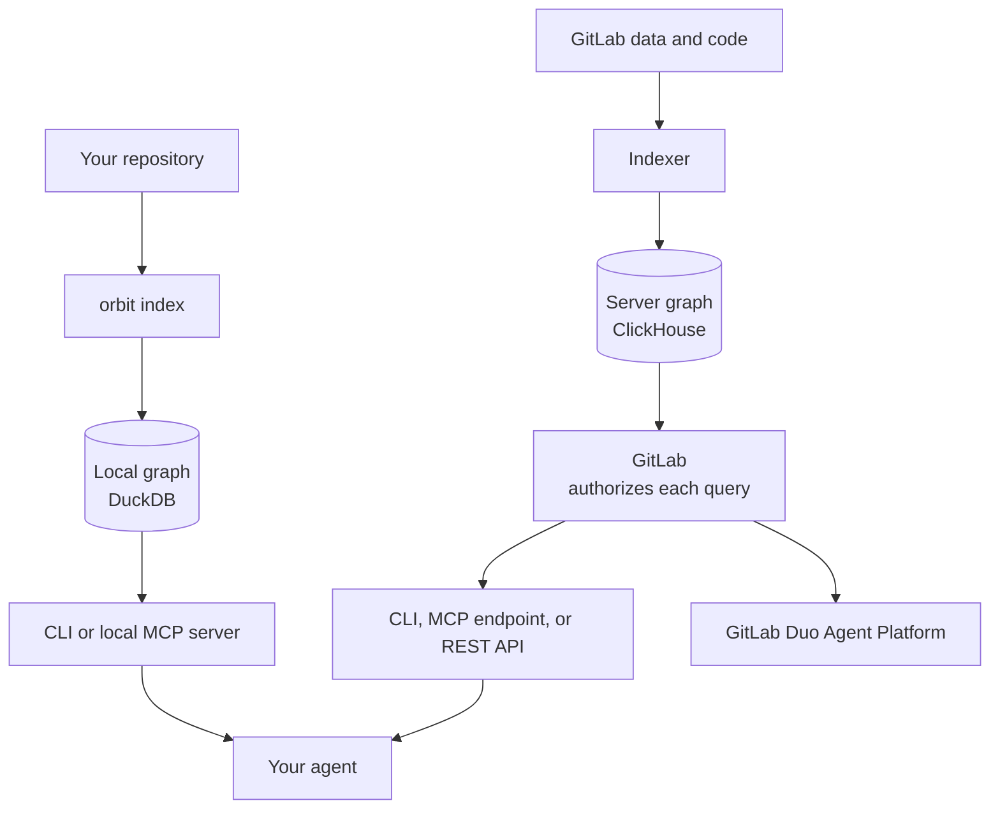



- Tier: Free, Premium, Ultimate
- Offering: GitLab.com, GitLab Self-Managed, GitLab Dedicated
- Status: Beta





- GitLab Orbit Remote [introduced](https://gitlab.com/gitlab-org/gitlab/-/work_items/583676) in GitLab 18.10 [with a feature flag](https://docs.gitlab.com/administration/feature_flags/) named `knowledge_graph`. Disabled by default. This feature is an [experiment](https://docs.gitlab.com/policy/development_stages_support/#experiment).
- GitLab Orbit Remote [changed](https://gitlab.com/gitlab-org/gitlab/-/work_items/583676) to [beta](https://docs.gitlab.com/policy/development_stages_support/#beta) in GitLab 19.1.
- GitLab Orbit Local [introduced](https://gitlab.com/gitlab-org/orbit/knowledge-graph/-/work_items/324) in GitLab 19.0 as an experiment.
- GitLab Orbit Local [changed](https://gitlab.com/gitlab-org/orbit/knowledge-graph/-/work_items/324) to beta in GitLab 19.1.



> [!flag]
> The availability of this feature is controlled by a feature flag.
> For more information, see the history.
> This feature is available for testing, but not ready for production use.

GitLab Orbit is a read-only property graph of your code and your GitLab data.
It keeps the graph in two stores:

- The local graph is on your machine. It holds only code. `orbit index` builds it from the files on disk.
- The server graph is on GitLab. It holds SDLC data and code. The indexer builds it and keeps it current.

You and your agent use both stores through one CLI.
Local commands such as `grep`, `context`, `sql`, and `repo-map` read the local graph.
Server commands such as `query`, `ontology`, and `graph-status` send a request to GitLab.

## Compare the two graphs

| Property | Local graph | Server graph |
|----------|-------------|--------------|
| Runs on | Your machine | GitLab infrastructure |
| Storage | DuckDB file at `~/.gitlab/orbit/graph.duckdb` | ClickHouse, managed for you |
| Data | Code only | SDLC data and code |
| Code version | Working tree on disk, with uncommitted files | Default branch of each project |
| Scope | Each repository that you index | Each top-level group where GitLab Orbit is on |
| Refresh | Run `orbit index` again | Automatic |
| Branch selection | No | No |
| Network connection to query | Not required | Required |
| GitLab account | Not required | Required |
| Authorization | None | GitLab permissions of your account. See [roles](security.md#roles). |
| Query language | Read-only SQL | JSON query DSL, or GQL when the per-user `orbit_gql_queries` feature flag is on |
| Access | CLI, local MCP server | CLI, MCP endpoint, REST API, GitLab Duo Agent Platform, GitLab UI |

Both graphs parse code with the same parser and the same [supported languages](schema.md#supported-languages).

The GitLab Orbit skill tells your agent how to query each graph.
For more information, see [Connect AI agents](agents/_index.md).

| Skill guidance | Local graph | Server graph |
|----------------|-------------|--------------|
| Query language | Read-only SQL | JSON query DSL, or GQL when the per-user `orbit_gql_queries` feature flag is on |
| Query recipes to paste |  |  |
| Repository map helper |  |  |
| Reporting and coverage guidance |  |  |
| Setup checklist and troubleshooting |  |  |

## The local graph

### Indexing

When you run `orbit index`, the CLI:

1. Walks the working tree. It includes uncommitted files and respects `.gitignore`.
1. Sends each source file to a parser for its language: OXC for JavaScript and TypeScript,
   rust-analyzer for Rust, and tree-sitter for the other languages. All parsers run in parallel.
1. Extracts definitions, import declarations, and cross-file references.
1. Writes the nodes and edges to the DuckDB file.

Indexing never checks out another branch. It reads only the files on disk.
A medium-sized repository usually indexes in seconds.

### Storage

All indexed repositories share one DuckDB file.
To keep the file in a different directory, set `ORBIT_DATA_DIR`.
If `~/.gitlab/orbit` does not exist, the CLI moves an earlier `~/.orbit` directory to it.
The checkout path sets the project ID of a repository.
When you index the same checkout again, the new graph replaces the old graph for that checkout.
A branch switch alone does not change the stored graph.
To keep graphs for more than one branch, index each branch from a separate checkout or worktree.

### Queries

`orbit sql` opens the DuckDB file read-only and runs your SQL directly against the graph tables.
There is no query compilation and no authorization layer.
Anyone who can run the CLI can read all data in the file.
Results come back as a table, JSON, NDJSON, or CSV.

By default, the indexed commit of the current checkout scopes the tables.
Use `--all` to query every indexed repository and commit.

Index and query commands send no request off your machine.
The CLI still uses the network to install and update the binary, fetch the GitLab Orbit skill, and send telemetry.

## The server graph



- Tier: Premium, Ultimate
- Offering: GitLab.com, GitLab Self-Managed
- Status: Beta



### Indexing

The indexer reads data from two sources and writes one graph.

- SDLC data. GitLab streams change events through a change data capture (CDC) pipeline to the
  [GitLab Data Insights Platform](https://handbook.gitlab.com/handbook/engineering/architecture/design-documents/data_insights_platform/).
  The platform writes the records to ClickHouse tables. The indexer builds the graph from these tables.
  A new merge request, work item, or pipeline is in the graph within minutes.
- Source code. The indexer fetches source files through the GitLab internal API.
  It parses each file and writes definitions and imports as nodes and edges.
  It indexes the default branch only, and indexes again when the default branch changes.

The server graph is a point-in-time view, not a real-time view.
Results show your data as of the last index cycle.

Each entity, such as a project, a user, or a function, becomes a node.
Each relationship, such as a user who authored a merge request, becomes a directed edge.

The graph has two layers that connect:

- The SDLC layer holds GitLab objects. Projects belong to groups. Users author merge requests.
  Pipelines run on projects. Work items have assignees.
- The code layer holds code structure. Files define functions. Files import symbols from other files.
- A project contains branches, and a branch contains the directories and files of the code layer.

For the full list of node types and relationships, see [What GitLab Orbit indexes](schema.md).

### Queries

Every server query follows the same path:

1. GitLab receives the query from the CLI, the REST API, the MCP endpoint, or GitLab Duo Agent Platform.
1. The query engine validates the query against the current schema.
1. The query engine compiles the query to ClickHouse SQL.
1. ClickHouse runs the SQL against the graph tables.
1. GitLab removes each result that you cannot access. For more information, see [Security](security.md).
1. GitLab returns typed JSON results.

To see the compiled SQL in the response, set `options.include_debug_sql: true`.
The response includes the SQL only for instance administrators, and for direct members of the
GitLab organization with the Reporter role or higher.

### Performance

On GitLab.com, the server graph runs in a Kubernetes cluster that is separate from your GitLab instance.
It does not share compute or memory with GitLab.

The first index of a large group, with thousands of projects and millions of lines of code, takes minutes.
After a change, the next index takes seconds to minutes. The time depends on the size of the change.

### Data retention and deletion

When you turn off GitLab Orbit for a group, the indexed data stays for 30 days.
If you turn it on again in that period, GitLab cancels the deletion, and indexing continues from where it stopped.
After 30 days, GitLab deletes all graph data for the group, including nodes, edges, and indexing checkpoints.

## GitLab Self-Managed



- Tier: Premium, Ultimate
- Offering: GitLab Self-Managed
- Status: Beta



On GitLab Self-Managed, you run the server graph yourself with a Helm chart, together with Siphon.
Siphon copies your GitLab database into ClickHouse.
For a Linux package installation, use a separate Kubernetes cluster that can reach your GitLab server.
For a GitLab Helm chart installation, use the same cluster as GitLab.
For more information, see [GitLab Orbit on GitLab Self-Managed](self-managed/_index.md).

## Billing

The local graph never consumes GitLab Credits. All processing is on your machine.

During the beta, server queries do not consume GitLab Credits.
When GitLab Orbit is generally available, only graph queries consume GitLab Credits.

| Access method | Consumes GitLab Credits after GA | Stays free |
|---------------|----------------------------------|------------|
| CLI | `query` | `status`, `ontology`, `dsl`, `tools`, `graph-status` |
| REST API | `POST /api/v4/orbit/query`, `POST /api/v4/orbit/query/:name`, `POST /api/v4/orbit/agent/commands/query_graph` | All other endpoints |
| MCP endpoint | `invoke_command` calls that run `query_graph` | `list_commands`, `get_graph_schema`, `get_query_dsl`, `get_response_format` |
| GitLab Duo Agent Platform | Queries that the agent makes for you | None |

GitLab publishes the rates in
[GitLab Credits and usage billing](https://docs.gitlab.com/subscriptions/gitlab_credits/) before charging begins.

## Related topics

- [What GitLab Orbit indexes](schema.md)
- [Security](security.md)
- [CLI](cli.md)
- [Query language](queries/query-language.md)
- [Troubleshooting](troubleshooting.md)
