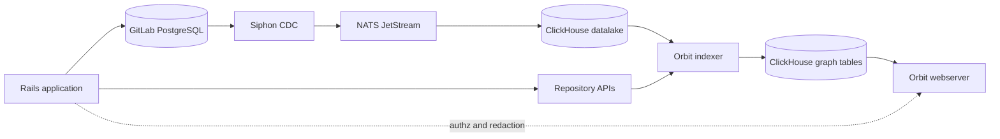
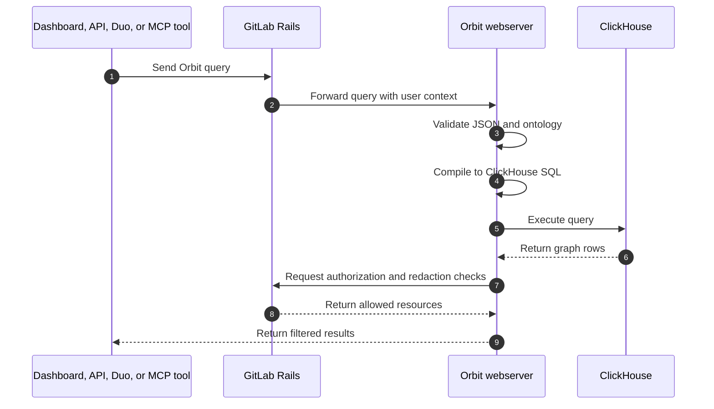



- Tier: Premium, Ultimate
- Offering: GitLab.com
- Status: Experiment





- [Introduced](https://gitlab.com/gitlab-org/gitlab/-/work_items/583676) in GitLab 18.10 [with a feature flag](https://docs.gitlab.com/administration/feature_flags/) named `knowledge_graph`. Disabled by default.



> [!flag]
> The availability of this feature is controlled by a feature flag.
> For more information, see the history.
> This feature is available for testing, but not ready for production use.

Orbit is a read-only graph service for GitLab data. GitLab remains the source of
truth for projects, groups, users, merge requests, work items, pipelines, code,
and permissions. Orbit builds a queryable graph from that data so clients can ask
relationship-based questions without chaining many REST or GraphQL calls.

## Deployed service architecture

The deployed Orbit service is separate from Rails. It does not write to GitLab
PostgreSQL. Orbit writes only to its own ClickHouse graph tables.

The main pieces are:

- Siphon streams GitLab PostgreSQL changes into ClickHouse.
- NATS JetStream coordinates indexing work.
- ClickHouse stores both raw replicated rows and Orbit graph tables.
- Orbit indexer workers transform SDLC and code data into graph nodes and edges.
- The Orbit webserver serves dashboard, API, and MCP queries.
- Rails handles user authentication, authorization, and redaction checks.

## Query flow

Orbit queries use a JSON query language. The query compiler validates the query,
checks it against the ontology, and compiles it into parameterized SQL for
ClickHouse.

Queries support traversal, aggregation, path finding, and neighbor exploration.
For details, see [Orbit query language](queries/query_language.md).

## Dashboard, API, and MCP consumers

The same deployed service powers several ways to work with the graph:

- The Orbit dashboard helps group owners turn on indexing, inspect graph status,
  browse the schema, and run queries.
- The Orbit API lets clients send JSON queries directly.
- GitLab Duo can use Orbit as a source of GitLab context.
- MCP-compatible tools can discover the schema and call Orbit tools.

## Local indexer is different

The local Orbit indexer is a developer preview. It indexes a local Git checkout
into DuckDB and runs local queries through the `orbit` CLI. It does not use
Siphon, NATS, ClickHouse, Rails authorization, or the hosted dashboard.

For details, see [Local Orbit indexer developer preview](local_indexer.md).
