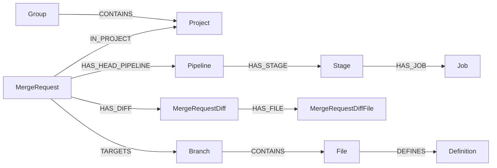



- Tier: Premium, Ultimate
- Offering: GitLab.com
- Status: Experiment





- [Introduced](https://gitlab.com/gitlab-org/gitlab/-/work_items/583676) in GitLab 18.10 [with a feature flag](https://docs.gitlab.com/administration/feature_flags/) named `knowledge_graph`. Disabled by default.



> [!flag]
> The availability of this feature is controlled by a feature flag.
> For more information, see the history.
> This feature is available for testing, but not ready for production use.

The Orbit schema describes the objects Orbit can index and the relationships it
can query. The deployed service exposes the live schema through the Orbit
dashboard, API, and MCP tools.

## Schema model

Orbit uses a property graph model:

- A node is an indexed object, such as a project, merge request, pipeline, file,
  or code definition.
- An edge is a relationship between two nodes, such as `AUTHORED`,
  `IN_PROJECT`, `HAS_JOB`, `CALLS`, or `CONTAINS`.
- A property is a value stored on a node or edge, such as a project path, merge
  request state, pipeline status, or file path.
- A domain groups related node types.

This model lets a query move across GitLab concepts without forcing the caller to
know which underlying GitLab table or API endpoint owns each object.

## Domains

The deployed schema is organized into these domains:

| Domain | What it covers | Example node types |
|--------|----------------|--------------------|
| `core` | GitLab instance structure and people. | `Group`, `Project`, `User`, `Note` |
| `plan` | Planning and tracking data. | `WorkItem`, `Milestone`, `Label` |
| `code_review` | Merge request data. | `MergeRequest`, `MergeRequestDiff`, `MergeRequestDiffFile` |
| `ci` | CI/CD execution and deployment data. | `Pipeline`, `Stage`, `Job`, `Runner`, `Deployment`, `Environment` |
| `security` | Security scanning and vulnerability data. | `Vulnerability`, `Finding`, `SecurityScan`, `VulnerabilityScanner` |
| `source_code` | Repository structure and code graph data. | `Branch`, `Directory`, `File`, `Definition`, `ImportedSymbol` |

The exact set of nodes and edges can change as Orbit adds coverage. Use the
dashboard or schema endpoint when you need the current schema for an instance.

## Relationship examples

Relationships connect domains. For example, a query can start at a group, find
projects in that group, find merge requests in those projects, inspect pipelines
for those merge requests, and then follow code relationships to files or
definitions.



Common relationship patterns include:

| Pattern | Example |
|---------|---------|
| Ownership and membership | `User` `MEMBER_OF` `Group`; `Group` `CONTAINS` `Project` |
| Planning and review | `MergeRequest` `CLOSES` `WorkItem`; `User` `AUTHORED` `MergeRequest` |
| CI/CD execution | `Pipeline` `HAS_STAGE` `Stage`; `Stage` `HAS_JOB` `Job` |
| Security | `SecurityScan` `HAS_FINDING` `Finding`; `Vulnerability` `HAS_IDENTIFIER` `VulnerabilityIdentifier` |
| Code structure | `Branch` `CONTAINS` `File`; `File` `DEFINES` `Definition`; `Definition` `CALLS` `Definition` |

## View the schema in the dashboard

To view the schema:

1. On the left sidebar, select **Search or go to**.
1. Select **Your work**.
1. Select **Orbit**.
1. Select **Schema**.
1. Search or filter by entity type.

From the schema view, you can jump from an entity type to matching instances in
the graph.

## Retrieve the schema with the API

To retrieve the schema:

```shell
curl --header "PRIVATE-TOKEN: <your_access_token>" \
  --url "https://gitlab.example.com/api/v4/orbit/schema?expand=Project"
```

To expand all node types:

```shell
curl --header "PRIVATE-TOKEN: <your_access_token>" \
  --url "https://gitlab.example.com/api/v4/orbit/schema?expand=*"
```

For more information, see the [Orbit API](https://docs.gitlab.com/api/orbit/).

## Retrieve the schema with MCP

MCP-compatible tools can call `get_graph_schema` to discover available entities
and relationships before they write a query.

For more information, see [Orbit MCP tools](queries/mcp_tools.md).
