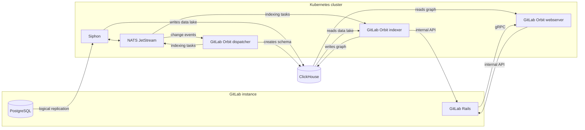



- Tier: Premium, Ultimate
- Offering: GitLab Self-Managed
- Status: Experiment





- [Introduced](https://gitlab.com/groups/gitlab-org/-/epics/22739) in GitLab 19.2.2.



> [!note]
> GitLab Orbit on GitLab Self-Managed is an
> [experiment](https://docs.gitlab.com/policy/development_stages_support/#experiment)
> available only to design partners. It is not ready for production use.

On GitLab.com, GitLab Orbit runs on GitLab infrastructure.
On GitLab Self-Managed, you run GitLab Orbit next to your instance.

A GitLab Orbit deployment has two parts:

- A data pipeline that copies the GitLab database into ClickHouse.
- GitLab Orbit, which turns that copy into a queryable graph.

The data pipeline does not depend on GitLab Orbit, so you can verify the pipeline before you install
GitLab Orbit.

GitLab Orbit is distributed only as a Helm chart for Kubernetes. The Linux package does not include it.
Install the chart on the cluster that runs GitLab, or on a separate cluster next to your instance.

Because GitLab Orbit on GitLab Self-Managed is an experiment available only to design partners, contact
your account team before you plan a deployment to confirm current limitations.

## Architecture

| Component | Function |
|-----------|----------|
| Siphon | Copies rows from PostgreSQL into the ClickHouse data lake, through NATS. |
| Dispatcher | Watches the same NATS stream, owns the graph schema, and publishes indexing tasks back to NATS. |
| Indexer | Takes indexing tasks from NATS, reads the data lake, fetches source code over the GitLab internal API, and writes the property graph. |
| Webserver | Answers queries from the graph, and fetches file content over the internal API when a query needs it. |

GitLab reaches the webserver over gRPC.

## In this section

| Page | Description |
|------|-------------|
| [Get started](getting-started.md) | Prerequisites, installation order, and shared configuration values |
| [Set up data replication](data-replication.md) | PostgreSQL logical replication and Siphon |
| [Set up GitLab Orbit](orbit-setup.md) | The ClickHouse database and identities, the GitLab connection, the GitLab Orbit chart, and group indexing |

## Known limitations

GitLab Orbit does not run on a GitLab Geo secondary site. No FIPS-compliant builds are available.

Redundancy and recovery for GitLab Orbit are not documented. GitLab Orbit holds no data of its own, so if
you lose the graph database, you can rebuild it by indexing again.

For the support that applies during an experiment, see
[experiment](https://docs.gitlab.com/policy/development_stages_support/#experiment) and the
[Statement of Support](https://about.gitlab.com/support/statement-of-support/).
