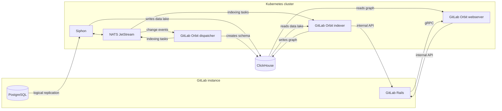



- Tier: Premium, Ultimate
- Offering: GitLab Self-Managed
- Status: Beta





- [Introduced](https://gitlab.com/groups/gitlab-org/-/epics/22739) in GitLab 19.3.



On GitLab.com, GitLab Orbit runs on GitLab infrastructure. On GitLab Self-Managed you run it yourself,
next to your instance.

You install two things. First a data pipeline that copies your GitLab database into ClickHouse, then
GitLab Orbit itself, which turns that copy into a queryable graph. The data pipeline stands on its own,
so you can verify it before you install GitLab Orbit.

GitLab does not ship GitLab Orbit in the Linux package. The only supported deployment is the Helm chart
on Kubernetes, either on the GitLab cluster or on a cluster next to your instance.

## Architecture

Siphon copies rows out of PostgreSQL into the ClickHouse data lake, passing them through NATS on the
way. The dispatcher watches the same NATS stream to learn what changed, owns the graph schema, and
publishes indexing tasks back to NATS. The indexer takes those tasks, reads the data lake, fetches
source code over the GitLab internal API, and writes the property graph. The webserver answers queries
from that graph, fetching file content over the internal API when a query needs it, and GitLab reaches
it over gRPC.

## In this section

| Page | Description |
|---|---|
| [Get started](getting-started.md) | What you need before you begin, and in which order to install it |
| [Set up data replication](data-replication.md) | PostgreSQL logical replication and Siphon |
| [Set up GitLab Orbit](orbit-setup.md) | ClickHouse identities, the GitLab Orbit chart, and enabling a group |

## What is not covered

GitLab Orbit on GitLab Self-Managed is in beta. Onboarding happens together with GitLab, so contact your
account team before you plan a deployment.

- **High availability and disaster recovery.** GitLab Orbit holds no data of its own. If you lose the
  graph database, you rebuild it by indexing again.
- **GitLab Geo.** GitLab Orbit is not supported on a secondary site.
- **FIPS.** GitLab Orbit has no FIPS builds.
