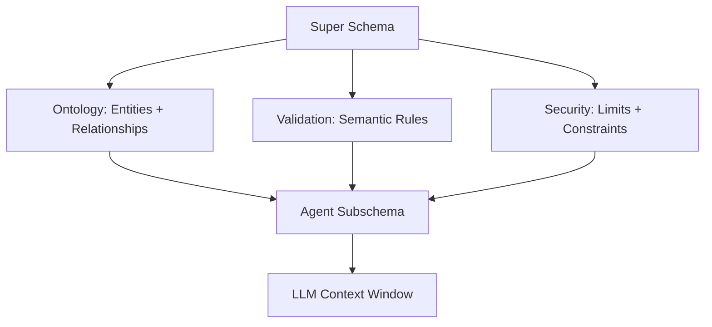

<style scoped>
.slidev-layout {
  background: linear-gradient(135deg, #1a1a2e 0%, #16213e 50%, #0f0f23 100%);
}
</style>

# GKGaaS Graph Engine

JSON DSL → SQL compiler

<div class="abs-br m-6 text-sm opacity-50">
  GitLab Knowledge Graph
</div>

<!--
We're going to walk through how the query engine turns JSON graph queries into ClickHouse SQL. It's a straightforward pipeline with eight phases.
-->

---
layout: two-cols
layoutClass: gap-8
---

# Why not just write SQL?

<v-clicks>

- **Agent Friendly** - LLMs generate structured JSON reliably
- **Security** - Easier to manage injection risk, DoS risk, AuthZ risk
- **Portability** - Expanding beyond Clickhouse SQL
- **Easy to Sync** - Schema derived from ontology

</v-clicks>

::right::

<div class="[&_pre]:!whitespace-pre-wrap [&_code]:!whitespace-pre-wrap mt-12">

```json
{
  "query_type": "traversal",
  "nodes": [
    { "id": "u", "entity": "User",
      "columns": ["username", "name"], "node_ids": [1] },
    { "id": "mr", "entity": "MergeRequest",
      "columns": ["iid", "title", "state", "source_branch"] },
    { "id": "p", "entity": "Project",
      "columns": ["name", "full_path"] }
  ],
  "relationships": [
    { "type": "AUTHORED", "from": "u", "to": "mr" },
    { "type": "IN_PROJECT", "from": "mr", "to": "p" }
  ],
  "limit": 50
}
```

</div>

<!--
Why not just write SQL? Four reasons. First, agents can generate this reliably - structured output is easier than freeform SQL. Second, there's no string interpolation so injection is impossible. Third, we can change the SQL backend without breaking API clients. Fourth, the schema comes from the ontology so it stays in sync automatically.
-->

---

# How do we implement this?

<div class="flex items-center justify-center gap-3 h-[80%]">

<div v-click="1" class="flex flex-col">
  <div class="text-xs font-bold mb-1 text-center">JSON DSL Query</div>
  <div class="text-[0.5rem] leading-tight">

```json
{
  "query_type": "traversal",
  "nodes": [
    { "id": "u", "entity": "User",
      "columns": ["username"],
      "node_ids": [1] },
    { "id": "mr", "entity": "MergeRequest",
      "columns": ["title"] },
    { "id": "p", "entity": "Project",
      "columns": ["name"] }
  ],
  "relationships": [
    { "type": "AUTHORED",
      "from": "u", "to": "mr" },
    { "type": "IN_PROJECT",
      "from": "mr", "to": "p" }
  ]
}
```

  </div>
</div>

<div v-click="2" class="text-3xl text-red-500 font-bold">→</div>

<div v-click="2" class="border-2 border-red-500 rounded min-w-28 h-12 relative">
  <span v-click.hide="4" class="text-2xl text-red-500 font-bold absolute inset-0 flex items-center justify-center">?</span>
  <span v-click="4" class="text-lg text-red-500 font-bold absolute inset-0 flex items-center justify-center">compiler</span>
</div>

<div v-click="3" class="text-3xl text-red-500 font-bold">→</div>

<div v-click="3" class="flex flex-col">
  <div class="text-xs font-bold mb-1 text-center">Generated SQL</div>
  <div class="text-[0.45rem] leading-tight">

```sql
SELECT u.username, mr.title, p.name
FROM gl_user AS u
JOIN gl_edges AS e0
  ON u.id = e0.source_id
JOIN gl_merge_request AS mr
  ON e0.target_id = mr.id
JOIN gl_edges AS e1
  ON mr.id = e1.source_id
JOIN gl_project AS p
  ON e1.target_id = p.id
WHERE u.id IN ({p0:Int64})
  AND e0.relationship_kind = {type_e0:String}
  AND e1.relationship_kind = {type_e1:String}
  AND startsWith(mr.traversal_path, {p1:String})
  AND startsWith(p.traversal_path, {p1:String})
```

  </div>
</div>

</div>

<!--
This is the transformation we're building. JSON query on the left, SQL on the right. The compiler in the middle is what we're going to walk through step by step.
-->

---
transition: fade-out

---

# Summary

<div class="flex flex-col items-center gap-1">

<div class="border-2 border-red-400 bg-red-50 dark:bg-red-900/20 rounded px-6 py-1 text-sm">
  🔓 JSON Input (untrusted)
</div>

<div class="text-lg">↓</div>

<div class="flex gap-2 items-center text-xs">
  <div class="border rounded px-2 py-1 bg-yellow-50 dark:bg-yellow-900/20">schema</div>
  <span>→</span>
  <div class="border rounded px-2 py-1 bg-yellow-50 dark:bg-yellow-900/20">ontology</div>
  <span>→</span>
  <div class="border rounded px-2 py-1 bg-yellow-50 dark:bg-yellow-900/20">parse</div>
  <span>→</span>
  <div class="border rounded px-2 py-1 bg-yellow-50 dark:bg-yellow-900/20">validate</div>
  <span class="text-red-500 ml-2">→ ❌</span>
</div>

<div class="text-lg">↓</div>

<div class="border-2 border-green-400 bg-green-50 dark:bg-green-900/20 rounded px-4 py-2">
  <div class="text-xs text-center mb-1 font-bold">🔒 Trusted Zone</div>
  <div class="flex gap-2 items-center text-xs">
    <div class="border rounded px-2 py-1">normalize</div>
    <span>→</span>
    <div class="border rounded px-2 py-1">lower</div>
    <span>→</span>
    <div class="border-2 border-blue-400 bg-blue-50 dark:bg-blue-900/20 rounded px-2 py-1 font-bold">AST</div>
    <span>→</span>
    <div class="border-2 border-purple-400 bg-purple-50 dark:bg-purple-900/20 rounded px-2 py-1 font-bold">AuthZ</div>
    <span>→</span>
    <div class="border rounded px-2 py-1">codegen</div>
  </div>
</div>

<div class="text-lg">↓</div>

<div class="border-2 border-green-500 bg-green-100 dark:bg-green-900/30 rounded px-6 py-1 text-sm font-bold">
  Parameterized SQL ✓
</div>

</div>

<div class="mt-4 text-sm">
<v-clicks>

- Validate early, fail fast - bad queries should never touch the database
- Strong separation of concerns - lowering should never involve validation, etc.
- AuthZ: redaction context + traversal path checks injected via AST manipulation
- Parameterized SQL output - hardened

</v-clicks>
</div>

<!--
The funnel: untrusted JSON enters at top, validation gates reject bad queries, and only valid queries cross into the trusted zone where we build and manipulate the AST. Output is always safe parameterized SQL.
-->

---

---

# The Compiler

```rust {all|2}
fn compile(json: &str, ontology: &Ontology, ctx: &SecurityContext) -> Result<SQL> {
    let value = validate_json(json)?;            // JSON structure ok?
    validate_ontology(&value, ontology)?;        // entities exist?
    let input = parse(value)?;                   // JSON → typed struct
    validate(&input, ontology)?;                 // references valid?
    let input = normalize(input, ontology);      // canonicalize
    let mut ast = lower(&input)?;                // build SQL AST
    let ctx = enforce_return(&mut ast, &input)?; // for redaction
    apply_security(&mut ast, ctx)?;              // tenant isolation
    codegen(&ast, ctx)                           // AST → SQL
}
```

<!--
Here's the compiler. Nine lines, each doing one thing. We'll walk through what each step does.
-->

---

# Phase 1: Schema Validation

<div class="grid grid-cols-[1fr_auto_auto_auto_1fr] gap-4 items-center h-[85%]">

<div class="flex flex-col">
  <div class="text-xs font-bold mb-1 text-center">schema.json</div>
  <div class="text-[0.5rem] leading-tight">

```json
{
  "required": ["query_type"],
  "properties": {
    "query_type": {
      "enum": ["traversal", "search",
               "aggregation", "path_finding"]
    },
    "nodes": {
      "type": "array",
      "items": { "$ref": "#/$defs/NodeSelector" }
    },
    "limit": {
      "type": "integer",
      "minimum": 1,
      "maximum": 1000
    }
  },
  "allOf": [{
    "if": { "query_type": "traversal" },
    "then": { "nodes": { "minItems": 2 } }
  }]
}
```

  </div>
</div>

<div v-click="1" class="text-3xl">+</div>

<div v-click="1" class="flex flex-col">
  <div class="text-xs font-bold mb-1 text-center">JSON DSL Query</div>
  <div class="text-[0.5rem] leading-tight">

```json
{
  "query_type": "traversal",
  "nodes": [
    { "id": "u", "entity": "User" },
    { "id": "mr", "entity": "MR" }
  ],
  "limit": 50
}
```

  </div>
</div>

<div class="flex flex-col gap-4 text-sm">
  <div v-click="2" class="flex items-center gap-2">
    <span class="text-2xl">↗</span>
    <div class="border-2 border-red-500 rounded px-3 py-2 bg-red-50 dark:bg-red-900/20">
      <div class="text-red-600 dark:text-red-400 font-bold mb-1">Error:</div>
      <span class="text-red-600 dark:text-red-400 font-mono text-xs">"traversal" requires<br/>"nodes" minItems: 2</span>
    </div>
  </div>
  <div v-click="3" class="flex items-center gap-2">
    <span class="text-2xl">↘</span>
    <div class="border-2 border-green-500 rounded px-3 py-2 bg-green-50 dark:bg-green-900/20">
      <span class="text-green-600 dark:text-green-400 font-bold">Accept</span>
    </div>
  </div>
</div>

</div>

<!--
The schema does structural validation. It checks required fields, types, enums, and conditional rules. If you say query_type is traversal, you need at least two nodes. Errors are specific - the message tells you exactly what's wrong.
-->

---

# Phase 2: Ontology Validation + Parse

```rust {3-4}
fn compile(json: &str, ontology: &Ontology, ctx: &SecurityContext) -> Result<SQL> {
    let value = validate_json(json)?;            // JSON structure ok?
    validate_ontology(&value, ontology)?;        // entities exist?
    let input = parse(value)?;                   // JSON → typed struct
    validate(&input, ontology)?;                 // references valid?
    let input = normalize(input, ontology);      // canonicalize
    let mut ast = lower(&input)?;                // build SQL AST
    let ctx = enforce_return(&mut ast, &input)?; // for redaction
    apply_security(&mut ast, ctx)?;              // tenant isolation
    codegen(&ast, ctx)                           // AST → SQL
}
```

<!--
Now we validate that the entities and relationships in the query actually exist in our ontology, then parse into a typed struct.
-->

---

# Phase 2: Ontology Validation + Parse (Cont.)

<div class="flex items-center justify-center gap-3 h-[75%]">

<div class="flex flex-col">
  <div class="text-xs font-bold mb-1 text-center">schema.json</div>
  <div class="text-[0.5rem] leading-tight">

```json
{
  "$defs": {
    "EntityType": { "enum": [] },
    "RelationshipTypeName": { "enum": [] },
    "NodeProperties": {}
  }
}
```

  </div>
</div>

<div v-click="1" class="text-2xl">+</div>

<div v-click="1" class="flex flex-col">
  <div class="text-xs font-bold mb-1 text-center">ontology/core/nodes/project.yaml</div>
  <div class="text-[0.5rem] leading-tight">

```yaml
node_type: MergeRequest
properties:
  id: { type: int64 }
  description: { type: string }
```

  </div>
</div>

<div v-click="2" class="text-2xl">→</div>

<div v-click="2" class="text-sm bg-gray-100 dark:bg-gray-800 rounded px-4 py-3 text-center font-bold">
  Validate Populated<br/>JSON Schema
</div>

<div v-click="3" class="flex flex-col gap-2">
  <div class="flex items-center gap-2">
    <span class="text-2xl">↗</span>
    <div class="border-2 border-red-500 rounded px-3 py-2 bg-red-50 dark:bg-red-900/20">
      <span class="text-red-600 dark:text-red-400 font-bold">Error</span>
    </div>
  </div>
  <div class="flex items-center gap-2">
    <span class="text-2xl">↘</span>
    <div class="border-2 border-green-500 rounded px-3 py-2 bg-green-50 dark:bg-green-900/20">
      <span class="text-green-600 dark:text-green-400 font-bold">parse()</span>
    </div>
  </div>
</div>

</div>

<div v-click="3" class="text-xs text-center text-gray-500">
  At runtime: enum: [] becomes enum: ["User", "Project", "MergeRequest", ...]
</div>

<!--
The ontology fills in the schema gaps. EntityType is a placeholder - at runtime we inject the actual node types from our YAML definitions. So if you try to query a "Foobar" entity that doesn't exist, the schema validator catches it before we even parse.
-->

---

# Phase 3: Semantic Validation

```rust {5}
fn compile(json: &str, ontology: &Ontology, ctx: &SecurityContext) -> Result<SQL> {
    let value = validate_json(json)?;            // JSON structure ok?
    validate_ontology(&value, ontology)?;        // entities exist?
    let input = parse(value)?;                   // JSON → typed struct
    validate(&input, ontology)?;                 // references valid?
    let input = normalize(input, ontology);      // canonicalize
    let mut ast = lower(&input)?;                // build SQL AST
    let ctx = enforce_return(&mut ast, &input)?; // for redaction
    apply_security(&mut ast, ctx)?;              // tenant isolation
    codegen(&ast, ctx)                           // AST → SQL
}
```

<v-clicks>

- Nodes exist and have entity types
- Column names match the entity's schema
- Aggregation targets are real entities
- Order by references valid node + property
- <span class="text-red-500">Goal: fold this into jsonschema so we have one validation pass</span>

</v-clicks>

<!--
Semantic validation catches things the schema can't. Does node "u" actually exist when you reference it in a relationship? Does the "foobar" column exist on the User entity? This is where we catch typos and logic errors.
-->

---

# Phase 4: Normalize

```rust {6}
pub fn compile(json_input: &str, ontology: &Ontology, ctx: &SecurityContext) -> Result<ParameterizedQuery> {
    let value = validate_json(json_input)?;
    validate_ontology(&value, ontology)?;
    let input: Input = serde_json::from_value(value)?;
    validate::validate(&input, ontology)?;
    let input = normalize::normalize(input, ontology);
    let mut node = lower::lower(&input)?;
    let result_context = enforce_return(&mut node, &input)?;
    apply_security_context(&mut node, ctx)?;
    codegen(&node, result_context)
}
```

<v-click>

**Transforms:**
- `"entity": "User"` → `"table": "gl_user"`
- Enum integers → string labels (`0` -> `"closed"`)
- More to come...

</v-click>

<!--
Normalization puts the input in canonical form. Entity names become table names. Wildcard column selections expand to explicit lists. Enum filter values get coerced from integers to their string labels.
-->

---

# Phase 5: Lower

```rust {7}
fn compile(json: &str, ontology: &Ontology, ctx: &SecurityContext) -> Result<SQL> {
    let value = validate_json(json)?;            // JSON structure ok?
    validate_ontology(&value, ontology)?;        // entities exist?
    let input = parse(value)?;                   // JSON → typed struct
    validate(&input, ontology)?;                 // references valid?
    let input = normalize(input, ontology);      // canonicalize
    let mut ast = lower(&input)?;                // build SQL AST
    let ctx = enforce_return(&mut ast, &input)?; // for redaction
    apply_security(&mut ast, ctx)?;              // tenant isolation
    codegen(&ast, ctx)                           // AST → SQL
}
```

<!--
Lowering builds a SQL AST from the validated input. This is where the magic happens.
-->

---

# Phase 5: Lower (Cont.)

<div class="flex items-center justify-center gap-4 h-[80%]">

<div class="border rounded px-4 py-2 bg-blue-50 dark:bg-blue-900">
  Validated Input
</div>

<div class="text-2xl">→</div>

<div class="border rounded px-4 py-2 bg-green-50 dark:bg-green-900">
  AST
</div>

<div class="text-2xl">→</div>

<div v-click="1" class="text-[0.4rem] leading-tight">

```rust
Query {
  select: vec![
    SelectExpr::new(Expr::col("p", "path_ids"), "path_ids"),
    SelectExpr::new(
      Expr::func("arrayConcat", vec![
        Expr::col("p", "path"),
        Expr::func("array", vec![next_tuple])
      ]), "path"),
  ],
  from: TableRef::join(
    JoinType::Inner,
    TableRef::scan("paths", "p"),
    TableRef::scan("gl_edges", "e"),
    Expr::eq(Expr::col("p", "node_id"), Expr::col("e", "source_id"))
  ),
  where_clause: Expr::and(
    Expr::lt(Expr::col("p", "depth"), Expr::param("max_depth")),
    Expr::not(Expr::func("has", vec![...]))
  ),
  ..Default::default()
}
```

</div>

<div v-click="2" class="text-3xl text-red-500 font-bold ml-2">
  Scary!
</div>

</div>

<!--
The AST is verbose. That's the point - it captures everything needed to generate correct SQL. We'll see in a minute how codegen turns this into readable SQL.
-->

---

# It's just a query builder

<div class="flex justify-center gap-12 h-[75%] items-center">

<div v-click="1" class="text-center">
<div class="text-sm font-bold mb-2">Prisma</div>
<div class="text-[0.4rem] leading-tight">

```typescript
prisma.user.findMany({
  where: { email: { contains: "@" } },
  include: { posts: true }
})
```

</div>
</div>

<div v-click="2" class="text-center">
<div class="text-sm font-bold mb-2">Drizzle ORM</div>
<div class="text-[0.4rem] leading-tight">

```typescript
db.select()
  .from(users)
  .leftJoin(posts, eq(id, authorId))
  .where(like(email, '%@%'))
```

</div>
</div>

<div v-click="3" class="text-center">
<div class="text-sm font-bold mb-2">Us</div>
<div class="text-[0.4rem] leading-tight">

```rust
Query {
  select: vec![...],
  from: TableRef::join(...),
  where_clause: Expr::and(...),
}
```

</div>
</div>

</div>

<div v-click="4" class="text-center text-gray-500 mt-4">
  Same idea: build a tree, emit SQL
</div>

<!--
This pattern is everywhere. Prisma builds an AST from its query objects. Drizzle chains methods to build a tree. We do the same thing - just in Rust with explicit struct construction.
-->

---

# Phase 5: Lower (Cont.) - Query Types

```rust
pub fn lower(input: &Input) -> Result<Node> {
    match input.query_type {
        QueryType::Traversal | QueryType::Search => lower_traversal(input),
        QueryType::Aggregation => lower_aggregation(input),
        QueryType::PathFinding => lower_path_finding(input),
        QueryType::Neighbors => lower_neighbors(input),
    }
}
```

<v-click>

Each query type has its own lowering strategy:
- **Search** - Select + Where
- **Traversal** - JOIN chain
- **Aggregation** - GROUP BY
- **PathFinding** - Recursive CTE
- **Neighbors** - Edge table scan

</v-click>

<!--
Different query types get different SQL patterns. Traversals become join chains. Aggregations add GROUP BY. Path finding generates recursive CTEs for graph traversal.
-->

---

# Phase 6: Enforce Return Context for Redaction

```rust {8}
fn compile(json: &str, ontology: &Ontology, ctx: &SecurityContext) -> Result<SQL> {
    let value = validate_json(json)?;            // JSON structure ok?
    validate_ontology(&value, ontology)?;        // entities exist?
    let input = parse(value)?;                   // JSON → typed struct
    validate(&input, ontology)?;                 // references valid?
    let input = normalize(input, ontology);      // canonicalize
    let mut ast = lower(&input)?;                // build SQL AST
    let ctx = enforce_return(&mut ast, &input)?; // for redaction
    apply_security(&mut ast, ctx)?;              // tenant isolation
    codegen(&ast, ctx)                           // AST → SQL
}
```

<v-clicks>

- For each entity alias (u, mr, p), inject hidden columns: `_gkg_u_id`, `_gkg_u_type`, etc.
- Type column is a literal: `'User' AS _gkg_u_type`, id is the actual value from the database
- Server extracts a list of tuples like `[(102, "User"), (103, "Project")]` to perform redaction against
- Special code path in the server for `neighbors`/`path_finding` to perform redaction against the dynamic nodes
- **This works because the query is an AST - we can manipulate it with code!**

</v-clicks>

<!--
We walk the AST and inject hidden columns. The server reads these after the query runs to figure out which rows to redact. You can't do this with string concatenation.
-->

---

# Phase 7: Security Context Injection

```rust {9}
fn compile(json: &str, ontology: &Ontology, ctx: &SecurityContext) -> Result<SQL> {
    let value = validate_json(json)?;            // JSON structure ok?
    validate_ontology(&value, ontology)?;        // entities exist?
    let input = parse(value)?;                   // JSON → typed struct
    validate(&input, ontology)?;                 // references valid?
    let input = normalize(input, ontology);      // canonicalize
    let mut ast = lower(&input)?;                // build SQL AST
    let ctx = enforce_return(&mut ast, &input)?; // for redaction
    apply_security(&mut ast, ctx)?;              // tenant isolation
    codegen(&ast, ctx)                           // AST → SQL
}
```

<v-clicks>

- Walk AST, find all table scans (skip edge table, skip `gl_users`)
- Inject `startsWith(traversal_path, $MY_TRAVERSAL_PATH)` into WHERE clause for each table
- Multiple paths? Use `startsWith(LOWEST_COMMON_PREFIX) AND (p1 OR p2 OR ...)`
- <span class="text-red-500">**Goal: Zero hardcoding, table skips are defined by the ontology**</span>

</v-clicks>

<!--
Same pattern as enforce_return. Walk the AST, find table scans, inject WHERE clauses. The path encodes the GitLab namespace hierarchy so you only see data in groups you have access to.
-->

---

# Phase 8: Codegen

```rust {10}
fn compile(json: &str, ontology: &Ontology, ctx: &SecurityContext) -> Result<SQL> {
    let value = validate_json(json)?;            // JSON structure ok?
    validate_ontology(&value, ontology)?;        // entities exist?
    let input = parse(value)?;                   // JSON → typed struct
    validate(&input, ontology)?;                 // references valid?
    let input = normalize(input, ontology);      // canonicalize
    let mut ast = lower(&input)?;                // build SQL AST
    let ctx = enforce_return(&mut ast, &input)?; // for redaction
    apply_security(&mut ast, ctx)?;              // tenant isolation
    codegen(&ast, ctx)                           // AST → SQL
}
```

<!--
Final step: walk the AST and emit SQL strings.
-->

---

# Phase 8: Codegen (Cont.)

<div class="flex items-center justify-center gap-3 h-[85%]">

<div>
<div class="text-xs font-bold mb-1 text-center">AST</div>
<div class="text-[0.3rem] leading-tight text-left">

```rust
Query {
  select: vec![
    SelectExpr::new(
      Expr::col("u", "name"),
      "u_name"
    ),
  ],
  from: TableRef::scan(
    "gl_user", "u"
  ),
  where_clause: Expr::eq(
    Expr::col("u", "id"),
    Expr::param("p0")
  ),
  limit: Some(10),
}
```

</div>
</div>

<div v-click="1" class="text-xl">→</div>

<div v-click="1">
<div class="text-xs font-bold mb-1 text-center">codegen()</div>
<div class="text-[0.25rem] leading-tight text-left">

```rust
let select_items: Vec<_> = q.select
    .iter()
    .map(|sel| {
        let expr = self.emit_expr(&sel.expr);
        match &sel.alias {
            Some(a) => format!("{expr} AS {a}"),
            None => expr,
        }
    }).collect();
parts.push(format!("SELECT {}", 
    select_items.join(", ")));
parts.push(format!("FROM {}", from.sql));
if !where_parts.is_empty() {
    parts.push(format!("WHERE {}", 
        where_parts.join(" AND ")));
}
```

</div>
</div>

<div v-click="2" class="text-xl">→</div>

<div v-click="2">
<div class="text-xs font-bold mb-1 text-center">Parameterized SQL</div>
<div class="text-[0.3rem] leading-tight text-left">

```sql
SELECT 
  u.name AS u_name,
  u.id AS _gkg_u_id,
  'User' AS _gkg_u_type
FROM gl_user AS u
WHERE u.id = {p0:Int64}
  AND startsWith(
    u.traversal_path, '1/2/')
LIMIT 10
```

</div>
</div>

</div>

<!--
Codegen is just string formatting. Walk each part of the Query struct, emit the corresponding SQL fragment, join them together. Values become parameterized placeholders.
-->

---

# Summary

<div class="flex flex-col items-center gap-1">

<div class="border-2 border-red-400 bg-red-50 dark:bg-red-900/20 rounded px-6 py-1 text-sm">
  🔓 JSON Input (untrusted)
</div>

<div class="text-lg">↓</div>

<div class="flex gap-2 items-center text-xs">
  <div class="border rounded px-2 py-1 bg-yellow-50 dark:bg-yellow-900/20">schema</div>
  <span>+</span>
  <div class="border rounded px-2 py-1 bg-yellow-50 dark:bg-yellow-900/20">ontology</div>
  <span>→</span>
  <div class="border rounded px-2 py-1 bg-yellow-50 dark:bg-yellow-900/20">validate</div>
  <span>→</span>
  <div class="border rounded px-2 py-1 bg-yellow-50 dark:bg-yellow-900/20">parse</div>
  <span class="text-red-500 ml-2">→ ❌</span>
</div>

<div class="text-lg">↓</div>

<div class="border-2 border-green-400 bg-green-50 dark:bg-green-900/20 rounded px-4 py-2">
  <div class="text-xs text-center mb-1 font-bold">🔒 Trusted Zone</div>
  <div class="flex gap-2 items-center text-xs">
    <div class="border rounded px-2 py-1">normalize</div>
    <span>→</span>
    <div class="border rounded px-2 py-1">lower</div>
    <span>→</span>
    <div class="border-2 border-blue-400 bg-blue-50 dark:bg-blue-900/20 rounded px-2 py-1 font-bold">AST</div>
    <span>→</span>
    <div class="border-2 border-purple-400 bg-purple-50 dark:bg-purple-900/20 rounded px-2 py-1 font-bold">AuthZ</div>
    <span>→</span>
    <div class="border rounded px-2 py-1">codegen</div>
  </div>
</div>

<div class="text-lg">↓</div>

<div class="border-2 border-green-500 bg-green-100 dark:bg-green-900/30 rounded px-6 py-1 text-sm font-bold">
  Parameterized SQL ✓
</div>

</div>

<div class="mt-4 text-sm">
<v-clicks>

- Validate early, fail fast - bad queries should never touch the database
- Strong separation of concerns - lowering should never involve validation, etc.
- AuthZ: redaction context + traversal path checks injected via AST manipulation
- Parameterized SQL output - hardened

</v-clicks>
</div>

<!--
The funnel: untrusted JSON enters at top, validation gates reject bad queries, and only valid queries cross into the trusted zone where we build and manipulate the AST. Output is always safe parameterized SQL.
-->

---

# Vision

<div class="flex flex-col items-center gap-6 h-[80%] justify-center">

<!-- Inputs row -->
<div class="flex gap-8 items-center justify-center">
  <div v-click="2" class="border-2 border-dashed border-gray-400 rounded px-4 py-2 text-gray-500 min-w-24 text-center">Cypher</div>
  <div v-click="1" class="border-2 border-green-500 bg-green-50 dark:bg-green-900/20 rounded px-4 py-2 font-bold text-lg min-w-24 text-center">JSON DSL</div>
  <div v-click="2" class="border-2 border-dashed border-gray-400 rounded px-4 py-2 text-gray-500 min-w-24 text-center">SQL</div>
</div>

<!-- Arrows down -->
<div class="flex gap-8 items-center justify-center">
  <span v-click="2" class="text-xl text-gray-400 min-w-24 text-center">↘</span>
  <span v-click="1" class="text-2xl min-w-24 text-center">↓</span>
  <span v-click="2" class="text-xl text-gray-400 min-w-24 text-center">↙</span>
</div>

<!-- Compiler -->
<div class="border-4 border-blue-500 bg-blue-50 dark:bg-blue-900/20 rounded-full px-10 py-5 text-center">
  <div class="font-bold text-xl">Compiler</div>
  <div class="text-gray-600 dark:text-gray-400">AST</div>
</div>

<!-- Arrows down -->
<div class="flex gap-8 items-center justify-center">
  <span v-click="3" class="text-xl text-gray-400 min-w-24 text-center">↙</span>
  <span v-click="1" class="text-2xl min-w-24 text-center">↓</span>
  <span v-click="3" class="text-xl text-gray-400 min-w-24 text-center">↘</span>
</div>

<!-- Outputs row -->
<div class="flex gap-8 items-center justify-center">
  <div v-click="3" class="border-2 border-dashed border-gray-400 rounded px-4 py-2 text-gray-500 min-w-24 text-center">Postgres</div>
  <div v-click="1" class="border-2 border-green-500 bg-green-50 dark:bg-green-900/20 rounded px-4 py-2 font-bold text-lg min-w-24 text-center">ClickHouse</div>
  <div v-click="3" class="border-2 border-dashed border-gray-400 rounded px-4 py-2 text-gray-500 min-w-24 text-center">MySQL</div>
</div>

</div>

<!--
The compiler and AST are the stable core. Today we parse JSON and emit ClickHouse SQL. Tomorrow we could add Cypher parsing, GraphQL, or target Postgres, MySQL, whatever. The AST is the abstraction layer.
-->

---

# Vision (cont.)

<div class="flex flex-col items-center gap-4 h-[85%] justify-center">

<!-- Inputs row -->
<div class="flex gap-6 items-center justify-center">
  <div v-click="2" class="border-2 border-purple-500 bg-purple-50 dark:bg-purple-900/20 rounded px-4 py-2 font-bold text-lg min-w-28 text-center">ETL</div>
  <div class="border-2 border-green-500 bg-green-50 dark:bg-green-900/20 rounded px-4 py-2 font-bold text-lg min-w-28 text-center">GKG Query</div>
  <div v-click="2" class="border-2 border-purple-500 bg-purple-50 dark:bg-purple-900/20 rounded px-4 py-2 font-bold text-lg min-w-28 text-center">Mailbox</div>
</div>

<!-- Arrows down -->
<div class="flex gap-6 items-center justify-center">
  <span v-click="2" class="text-xl min-w-28 text-center">↘</span>
  <span class="text-2xl min-w-28 text-center">↓</span>
  <span v-click="2" class="text-xl min-w-28 text-center">↙</span>
</div>

<!-- Compiler box -->
<div class="border-4 border-blue-500 bg-blue-50 dark:bg-blue-900/20 rounded-xl px-8 py-4 text-center">
  <div class="font-bold text-xl">Compiler</div>
  <div class="text-sm text-gray-600 dark:text-gray-400">Parse → Normalize → Lower → Codegen</div>
</div>

<!-- Arrows down -->
<div class="flex gap-6 items-center justify-center">
  <span v-click="2" class="text-xl min-w-28 text-center">↙</span>
  <span class="text-2xl min-w-28 text-center">↓</span>
  <span v-click="2" class="text-xl min-w-28 text-center">↘</span>
</div>

<!-- Outputs row -->
<div class="flex gap-6 items-center justify-center">
  <div v-click="2" class="border-2 border-purple-500 bg-purple-50 dark:bg-purple-900/20 rounded px-4 py-2 font-bold text-lg min-w-28 text-center">DataFusion</div>
  <div class="border-2 border-green-500 bg-green-50 dark:bg-green-900/20 rounded px-4 py-2 font-bold text-lg min-w-28 text-center">ClickHouse</div>
  <div v-click="2" class="border-2 border-dashed border-gray-400 rounded px-4 py-2 text-gray-500 min-w-28 text-center">...</div>
</div>

</div>

<!--
First we show what exists today: GKG Query → Compiler → ClickHouse. Then we expand the vision: ETL and Mailbox can also use the compiler internals, targeting multiple backends.
-->

---

# Readiness Questions

- **Secure Aggregates**:
  - Do we need row-level redaction for aggregated entities? Or are Reporter+/Planner+ roles sufficient?
- **Approximate Aggregates**: Could bounded random sampling (e.g., sample for AVG) solve redaction limitations?
  - For large datasets? 
- **Security Threshold**: What threat modeling is sufficient for launch?
  - Beyond Sec reviews, what tools are used to validate ~similar~ access patterns to GKG like GraphQL? Fuzzing?
- **Performance**: Defining acceptable performance standards for GKG queries
  - What is acceptable latency, memory utilization per query for .com, self-managed?
- **Entity Rollout**: 6 domains (core, code_review, ci, security, plan, source_code) with 25+ entity types.
  - More rigorous integration testing per entity?
- **SSOT**: Ontology-driven schema validation. Interlock w/ Jean-Gabriel
  - How do we keep ontology in sync with Rails models? 

<!--
These are the key questions we need to answer before launch. Secure aggregates are the biggest concern - we rely on traversal_path filtering at query time, not row-level redaction of aggregated entities.
-->

---
layout: center
class: text-center
---

# Thank You!

<!--
Thank you for your time.
-->

---

<!-- Blank slide for Q&A -->

---
layout: center
class: text-center
---

# Appendix

<!--
Additional reference material follows.
-->

---

# Redaction Flow

Query Engine provides metadata for post-query redaction validation.

<div class="grid grid-cols-2 gap-4">
<div>

**Query Engine (`crates/query-engine`)**

```rust
// result_context.rs - Metadata for redaction
pub struct RedactionNode {
    pub alias: String,
    pub entity_type: String,
    pub id_column: String,   // _gkg_{alias}_id
    pub type_column: String, // _gkg_{alias}_type
}

// return.rs - Inject columns into SELECT
fn enforce_return_columns(q: &mut Query, ...) {
    for node in &input.nodes {
        ctx.add_node(&node.id, entity);
        q.select.push(SelectExpr {
            expr: Expr::col(&node.id, "id"),
            alias: Some(id_column(&node.id)),
        });
    }
}
```

</div>
<div>

**Query Pipeline (`crates/gkg-server`)**

```rust
// service.rs - Pipeline orchestration
let compiled = compile(query_json, &ontology, &ctx)?;
let batches = self.execute_query(&compiled).await?;

let extracted = self.extraction.execute(batches);
let authorized = AuthorizationStage::execute(extracted).await?;
let redacted = RedactionStage::execute(authorized);

// redaction.rs - Apply authorizations
input.query_result.apply_authorizations(
    &input.authorizations,
    &entity_map
);
```

</div>
</div>

---

# Redaction Flow - Schema Introspection

For `path_finding` and `neighbors` queries, entity types are unknown at compile time.

<div class="grid grid-cols-2 gap-4">
<div>

**Dynamic Node Discovery**

```rust
// query_result.rs - Extract from Arrow columns
fn extract_path_nodes(batch, row_idx) -> Vec<NodeRef> {
    // _gkg_path: Array(Tuple(Int64, String))
    let col = batch.column(PATH_COLUMN);
    // Returns [(node_id, entity_type), ...]
}

fn extract_neighbor_node(batch, row_idx) -> Option<NodeRef> {
    // _gkg_neighbor_id: Int64
    // _gkg_neighbor_type: String (runtime value!)
    let id = batch.column(NEIGHBOR_ID_COLUMN);
    let entity = batch.column(NEIGHBOR_TYPE_COLUMN);
    Some(NodeRef::new(id, entity))
}
```

</div>
<div>

**Why Not ResultContext?**

```rust
// ResultContext works for known entities:
ctx.add_node("u", "User");  // User is known
ctx.add_node("p", "Project"); // Project is known

// But path_finding/neighbors discover types at runtime:
// - Path: User -> Project -> Group -> ???
// - Neighbors: User's neighbors could be ANY type

// Solution: store dynamic_nodes per row
struct QueryResultRow {
    columns: HashMap<String, ColumnValue>,
    dynamic_nodes: Vec<NodeRef>, // runtime discovery
    authorized: bool,
}
```

</div>
</div>

---

# General Hydration Model

Move from query-specific hydration to a unified post-redaction enrichment pattern.

<div class="grid grid-cols-2 gap-4">
<div>

**Current: Neighbors-only Hydration**

```rust
// hydration.rs - Only for neighbors queries
pub async fn execute(&self, mut result: QueryResult, ...) {
    if !matches!(result_context.query_type, 
                 Some(QueryType::Neighbors)) {
        return Ok(result);  // Skip non-neighbors
    }
    
    let refs = self.extract_entity_refs(&result);
    let props = self.fetch_all_properties(&refs).await?;
    self.merge_properties(&mut result, &props);
    Ok(result)
}
```

</div>
<div>

**Future: Universal Hydration**

```rust
// Generalized pattern for all query types
pub async fn execute(&self, result: QueryResult, ...) {
    // 1. Get authorized entity refs (already redacted)
    let refs = result.authorized_rows()
        .flat_map(|r| r.all_node_refs())
        .collect();
    
    // 2. Batch fetch properties by type
    let props = self.fetch_properties_batch(&refs).await?;
    
    // 3. Hydrate (works for any query type)
    self.merge_properties(&mut result, &props);
    Ok(result)
}
```

</div>
</div>

**Benefits**: Decouple query execution from property fetching. Query returns IDs + edges, hydration fetches full entities. Enables caching, batching, and field selection.

---

# Performance

<style scoped>
table { font-size: 0.7em; }
th { font-weight: bold !important; }
.highlight { background-color: rgba(34, 197, 94, 0.2); font-weight: bold; }
</style>

**Simulator Run** — 29 queries, 11M nodes + 100M edges, ~954 MiB memory limit

<div class="grid grid-cols-2 gap-6">
<div>

| **Metric** | **Value** |
|--------|-------|
| Success rate | 89.7% (26/29) |
| Total time | 4,614 ms |
| <span class="highlight">Mean</span> | <span class="highlight">159 ms</span> |
| <span class="highlight">Median</span> | <span class="highlight">26 ms</span> |
| Min | 8 ms |
| Max | 1,389 ms |

</div>
<div>

| **Slowest Queries** | **Time** |
|-----------------|------|
| High weight work items | 1,389 ms |
| Confidential work items | 84 ms |
| Critical vulnerabilities | 66 ms |
| Pipeline success rate | 61 ms |
| MR reviewers per project | 53 ms |

</div>
</div>

**3 failures** (MEMORY_LIMIT_EXCEEDED): Shortest path CTE, Vulnerabilities→MRs join, Long-running pipelines

<!--
These are results from the simulator running against a 100M edge synthetic graph. Memory limit failures indicate queries that need optimization or sampling strategies. The median of 26ms is encouraging for interactive use cases.
-->

---

# Simulator

<style scoped>
pre { font-size: 0.55em !important; line-height: 1.3 !important; }
</style>

Generate synthetic graphs and evaluate query performance at scale.

<div class="grid grid-cols-2 gap-4">
<div>

**ClickHouse Configuration**

```yaml
# simulator.yaml
clickhouse:
  url: http://localhost:8123
  database: default
  
  schema:
    engine: MergeTree
    index_granularity: 8192
    node_primary_key: [traversal_path, id]
    edge_order_by: [source_id, source_kind, 
                    relationship_kind]
    
    projections:
      - name: by_target
        table: edges
        order_by: [target_id, target_kind]
```

</div>
<div>

**Graph Generation Config**

```yaml
generation:
  seed: 42
  organizations: 1
  
  roots:
    User: 10000    # 10k users
    Group: 20      # 20 top-level groups
  
  relationships:
    CONTAINS:
      "Group -> Project": 10
    IN_PROJECT:
      "MergeRequest -> Project": 100
      "Pipeline -> Project": 100
  
  associations:
    AUTHORED:
      "User -> MergeRequest": 100  # 30M edges
```

</div>
</div>

**Workflow**: `generate` → `load` → `evaluate` (100M edge scale test)

---

# Appendix: Probabilistic Aggregates

**Problem**: Redaction filters rows *after* aggregation → leaks counts of inaccessible data

**Solution**: Sample + redact *before* aggregation

<div class="grid grid-cols-2 gap-4 mt-4">
<div>

**Current (leaky)**

```sql
SELECT u.id, COUNT(mr.id) as mr_count
FROM users u
JOIN edges e ON ...
JOIN merge_requests mr ON ...
GROUP BY u.id
-- Redaction happens AFTER count
```

</div>
<div>

**Proposed (secure)**

```sql
SELECT u.id, 
  COUNT(mr.id) * (1.0 / 0.1) as mr_count_approx
FROM users u
JOIN edges e ON ...
JOIN merge_requests mr ON ...
WHERE cityHash64(mr.id) % 100 < 10  -- 10% sample
  AND mr.id IN (accessible_ids)      -- redact first
GROUP BY u.id
```

</div>
</div>

<div class="mt-4 text-sm text-gray-500">

- Bounded random sample (e.g., 10%) before redaction gives ~90% confidence interval
- Statistical guarantees vs exact counts - acceptable for dashboards/analytics
- ClickHouse `cityHash64` provides deterministic, uniform sampling

</div>

<!--
The key insight is that we sample BEFORE redaction, not after. This means inaccessible rows are filtered out before they can contribute to aggregates. The tradeoff is approximate results, but for large datasets this is often acceptable.
-->

---

# Appendix: JSON Schema Architecture

**Goal**: Single source of truth schema that powers validation, agents, and documentation

<div class="flex flex-col gap-4 mt-4">



</div>

<div class="grid grid-cols-2 gap-4 mt-4 text-sm">
<div>

**Super Schema includes**
- Entity types + properties (from ontology)
- Relationship types + cardinality
- Validation rules (required fields, node refs)
- Security constraints (max_hops, limits)

</div>
<div>

**Derived Subschemas**
- Per-agent: only entities they can access
- Per-query-type: traversal vs aggregation
- Compact: fit in LLM context window
- Versioned: track schema evolution

</div>
</div>

<!--
The super schema extends the current ontology/schema.json to include validation rules from validate.rs. From this, we can derive focused subschemas for specific agent use cases - smaller, targeted schemas that fit in context windows and only expose what the agent needs.
-->

---
